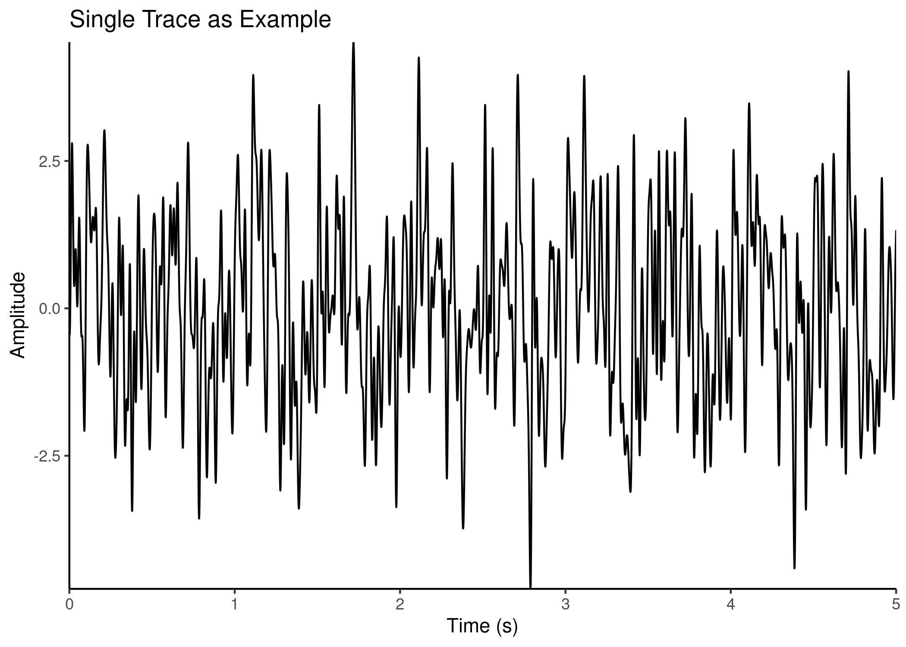

InVivoR Package
================

## Features

This package was developed to analyse electrophysiological data such as
field potentials and unit activity. Features include:

-   loading *.dat* files and processing traces (*filtering etc.*)
-   extraction of event snippets from trace (*ERPs*)
-   *Morlet wavelet transformation*
-   *Phase analysis* of ERPs
-   *Modulation-Index* calculation for field potentials
-   *Auto/Cross-Correlogram* for unit activity
-   and more

## Easy to use

Traces can be easily processed and analysed with only a few functions
required. To analyse ERPs we can extract trace snippets using the
`ERPMat()` function and later apply Morlet wavelet transforms.

To illustrate we can simply simulate several traces with different
frequency components and write them to a matrix as `ERPMat` would do as
well. Firstly we load the package and `data.table` and `ggplot2` to
further plot the data.

``` r
library(InVivoR)
library(data.table)
library(ggplot2)
```

``` r
trace <- sapply(X = 1:20, FUN = function(x){
  shiftOnset <- runif(n = 1, min = 0, max = pi)
  TraceOut <- sin(40*pi*seq(0,5,0.001))+sin(20*pi*seq(0,5,0.001))+sin(4*pi*seq(0,5,0.001))
  for(i in 1:40) {
    shiftOnset <- runif(n = 1, min = 0, max = pi)
    TraceOut <- TraceOut + 0.2*sin(runif(n = 1, min = 0.1, max = 100)*pi*seq(0+shiftOnset,5+shiftOnset,0.001))
  }
  TraceOut
  })
```

<!-- --> We can then provide
the function `WTbatch` with the trace matrix and the frequencies we want
to analyse. The package is also supports multiple cores which we can
define as well.

``` r
Frequencies <- seq(0.1,40,0.1)
WaveletTransform <- WTbatch(ERPMat = t(trace), frequencies = Frequencies, SamplingRate = 1e3, CORES = 4, PhaseAnalysis = T, sigma = 6)
```

    ## finished ERP

``` r
PowerMat <- abs(WaveletTransform$Raw)^2
rownames(PowerMat) <- seq(0,5,0.001)
colnames(PowerMat) <- Frequencies
```

<!-- --> The function
analyses all ERP snippets in one run and outputs a list with the
transforms. However, it can also be specified to collapse all ERPs to an
average to save memory. In practice we would like to average over
several trials and see the average response to isolate the signal. This
can be implemented manually or by using the

``` r
PowerAvg <- PowerMat(x = abs(WaveletTransform$Raw)^2)
rownames(PowerAvg) <- seq(0,5,0.001)
colnames(PowerAvg) <- Frequencies
```

    ## Warning in data.table::melt(PowerAvg): The melt generic in data.table has
    ## been passed a matrix and will attempt to redirect to the relevant reshape2
    ## method; please note that reshape2 is deprecated, and this redirection is now
    ## deprecated as well. To continue using melt methods from reshape2 while both
    ## libraries are attached, e.g. melt.list, you can prepend the namespace like
    ## reshape2::melt(PowerAvg). In the next version, this warning will become an
    ## error.

<!-- -->
